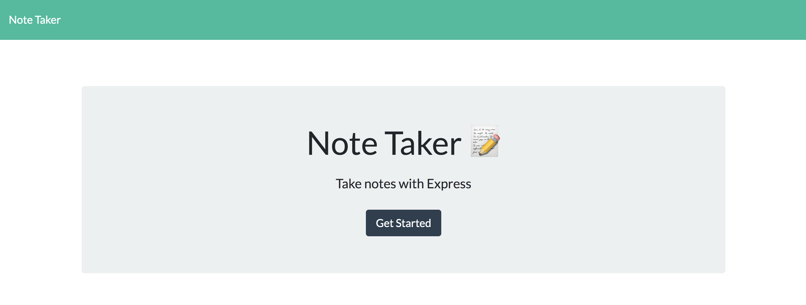
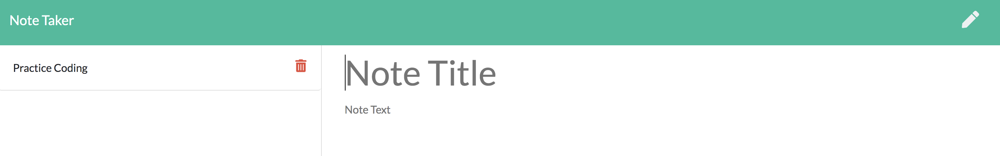
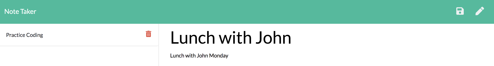
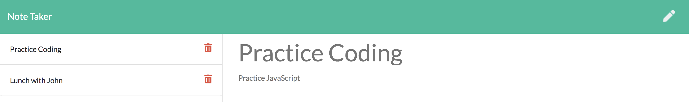
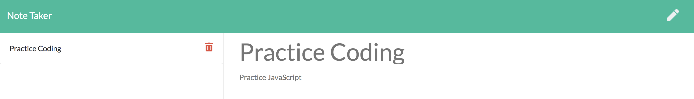
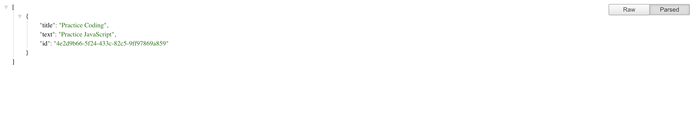

# note-taker

```
AS A small business owner
I WANT to be able to write and save notes
SO THAT I can organize my thoughts and keep track of tasks I need to complete
```

This is a simple note-taker app build using Express. When opened, the user is presented with a landing page:



When the user clicks `get started` they are taken to the notes page where the stored notes appear on the left side of the page and they are presented with a text area in which to enter new notes:



Once the user clicks into the text area to enter a note a save button appears in the upper right corner, allowing them to save the note they just entered:



If a user clicks on a note title in the left hand column, that note's title and text is shown on the right, clicking the pen icon at the top right will allow the user to again add a new note:



If the user wishes to delete a note, clicking the trash icon will remove the note from the column at the left and delete it from the api:



All the notes are available in JSON format on the api/notes page:



## The Code

This app is run with an Express.js server. To start the app using Node.js enter `node server.js` and navigate your brower to the appropriate page for the UI.

Using `fetch` commands, the app retrieves the data from the stored `db.json` file where the data is stored. The server utilizes the built in `fs` Node module to read and write to the file.

When a new note is added, a unique id is assigned server-side utilizing the <a href="https://www.npmjs.com/package/uuid">uuid</a> npm module. This allows for the delete function to pull the correct note from the db.json file. 

## Deployment

